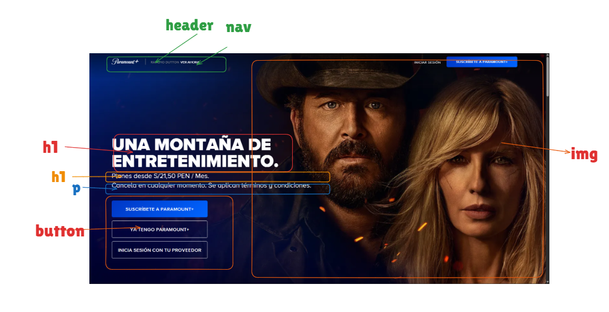

# 📄 Instrucciones

1. Crear un archivo `index.html`.  
2. Escoger una página web de referencia (en este caso, **Paramount+**).  
3. Estructurar con elementos semánticos de HTML la sección seleccionada.

---

## 🎬 Página Web Seleccionada

| Detalle | Descripción |
|----------|--------------|
| **Plataforma** | Paramount+ |
| **Sección** | Banner promocional en Perú con la serie *Rancho Dutton (Yellowstone)* |
| **Motivo de elección** | Presenta un diseño claro con título, subtítulos, botones de acción y elementos visuales, ideal para aplicar etiquetas semánticas. |

---

## 🏗️ Estructura Semántica Aplicada

El documento se organiza de arriba hacia abajo con los siguientes elementos:

- `<header>`: Contenedor superior que agrupa la identidad de la plataforma.  
- `<h1>`: Título principal: *"UNA MONTAÑA DE ENTRETENIMIENTO"*.  
- `<h2>`: Subtítulo con información de precios: *"Planes desde S/21,50 PEN / Mes"*.  
- `
`: Texto adicional: *"Cancela en cualquier momento. Se aplican términos y condiciones."*.  
- `<main>`: Contenido central con la imagen de fondo y los personajes de la serie.  
- `<button>`: Tres botones de acción:  
  - "SUSCRÍBETE A PARAMOUNT+"  
  - "YA TENGO PARAMOUNT+"  
  - "INICIA SESIÓN CON TU PROVEEDOR"  
- ``: Imagen promocional con los personajes de *Yellowstone*.  
- `<footer>`: Pie de página (puede incluir términos y condiciones o enlaces adicionales).

---
## 📊 Esquema Visual de la Estructura

